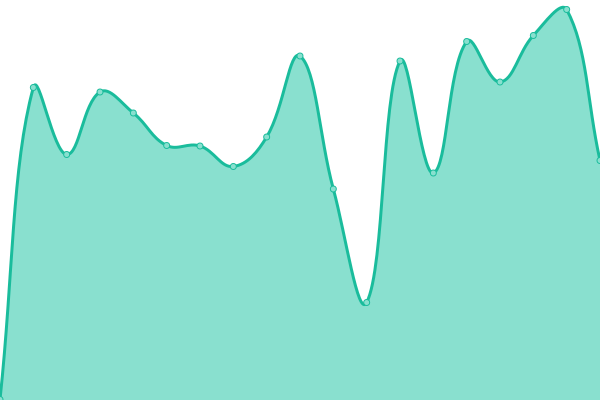
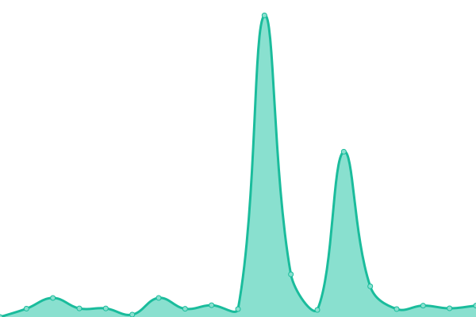

# [📈 Live Status](https://status.hentaios.com): <!--live status--> **🟧 Partial outage**

This repository contains the open-source uptime monitor and status page for [hentaiOS Infrastructure](hentaios.dev), powered by [Upptime](https://github.com/upptime/upptime).

With [Upptime](https://upptime.js.org), you can get your own unlimited and free uptime monitor and status page, powered entirely by a GitHub repository. We use [Issues](https://github.com/hentaiOS-Infrastructure/infra-status-upptime/issues) as incident reports, [Actions](https://github.com/hentaiOS-Infrastructure/infra-status-upptime/actions) as uptime monitors, and [Pages](https://status.hentaios.com) for the status page.

<!--start: status pages-->
<!-- This summary is generated by Upptime (https://github.com/upptime/upptime) -->
<!-- Do not edit this manually, your changes will be overwritten -->
<!-- prettier-ignore -->
| URL | Status | History | Response Time | Uptime |
| --- | ------ | ------- | ------------- | ------ |
|  [hentaiOS Download Page](https://downloads.hentaios.com) | 🟩 Up | [hentai-os-download-page.yml](https://github.com/hentaiOS-Infrastructure/infra-status-upptime/commits/HEAD/history/hentai-os-download-page.yml) | 

 979ms
     
 | 

<a href="https://status.hentaios.com/history/hentai-os-download-page">80.68%</a>
    

|  [hentaiOS Blog](https://blog.hentaios.com) | 🟩 Up | [hentai-os-blog.yml](https://github.com/hentaiOS-Infrastructure/infra-status-upptime/commits/HEAD/history/hentai-os-blog.yml) | 

 261ms
     
 | 

<a href="https://status.hentaios.com/history/hentai-os-blog">100.00%</a>
    

|  [hentaiOS Wiki](https://wiki.helluvaos.com) | 🟩 Up | [hentai-os-wiki.yml](https://github.com/hentaiOS-Infrastructure/infra-status-upptime/commits/HEAD/history/hentai-os-wiki.yml) | 

 192ms
     
 | 

<a href="https://status.hentaios.com/history/hentai-os-wiki">100.00%</a>
    

|  [hentaiOS Forum](https://forum.helluvaos.com) | 🟩 Up | [hentai-os-forum.yml](https://github.com/hentaiOS-Infrastructure/infra-status-upptime/commits/HEAD/history/hentai-os-forum.yml) | 

 650ms
     
 | 

<a href="https://status.hentaios.com/history/hentai-os-forum">80.68%</a>
    

|  [hentaiOS Mail](https://mail.hentaios.com) | 🟥 Down | [hentai-os-mail.yml](https://github.com/hentaiOS-Infrastructure/infra-status-upptime/commits/HEAD/history/hentai-os-mail.yml) | 

 482ms
     
 | 

<a href="https://status.hentaios.com/history/hentai-os-mail">0.00%</a>
    

|  [hentaiOS GitLab](https://gitlab.hentaios.com) | 🟥 Down | [hentai-os-git-lab.yml](https://github.com/hentaiOS-Infrastructure/infra-status-upptime/commits/HEAD/history/hentai-os-git-lab.yml) | 

 522ms
     
 | 

<a href="https://status.hentaios.com/history/hentai-os-git-lab">80.68%</a>
    

<!--end: status pages-->

[**Visit our status website →**](https://status.hentaios.com)

## 📄 License

- Powered by: [Upptime](https://github.com/upptime/upptime)
- Code: [MIT](./LICENSE) © [hentaiOS Infrastructure](hentaios.dev)
- Data in the `./history` directory: [Open Database License](https://opendatacommons.org/licenses/odbl/1-0/)
